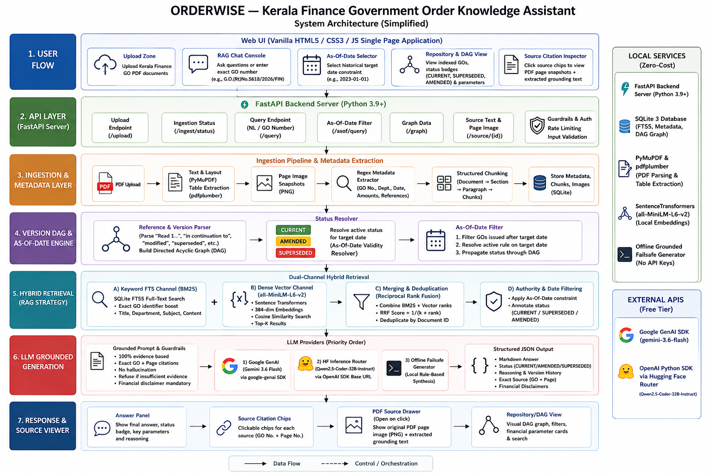

# ORDERWISE — Kerala Finance Government Order Knowledge Assistant

---

## 1. Usecase Name
**ORDERWISE — Kerala Finance Government Order Knowledge Assistant**

### System Architecture Diagram



---

## 2. What the Agent Does
ORDERWISE is a version-aware Hybrid RAG knowledge assistant designed for government finance officials. When a user asks a question or searches an exact Government Order (GO) number (e.g., `G.O.(Rt)No.5618/2026/FIN`, `G.O.(Ms)No.106/2026/FIN`), the agent:
1. **Identifies Authoritative Orders**: Traces supersession and amendment relationship chains across document versions.
2. **Evaluates Historical Validity**: Resolves rules as of any requested target date (As-Of-Date logic).
3. **Extracts Exact Table Semantics & Metadata**: Preserves financial parameters (budget allocations, monetary limits, interest rates, schedule dates).
4. **Generates Grounded Answers**: Delivers structured, synthesized responses citing exact source documents and page numbers.
5. **Provides Verifiable Proof**: Renders side-by-side original PDF page snapshots for visual verification.

---

## 3. Key Features

- **Version-Aware DAG Relationship Engine**:
  - Automatically parses document reference sections ("Read 1...", "in continuation to", "modified", "superseded").
  - Dynamically computes document statuses: `CURRENT`, `SUPERSEDED`, `AMENDED`, `HISTORICAL`, or `UNRESOLVED`.

- **As-Of-Date Historical Validity Resolver**:
  - Evaluates active rules as of any historical date requested by the official (e.g. KFC assistance limit on `2023-01-01` vs `2026-08-01`).
  - Automatically excludes orders issued after the target date and explains the version timeline.

- **Hybrid Retrieval Pipeline (BM25 + Dense Vector + RRF)**:
  - SQLite FTS5 Full-Text Search for high-precision exact GO number matching.
  - Dense Vector Search (`sentence-transformers` / `all-MiniLM-L6-v2`) for semantic concept queries.
  - Reciprocal Rank Fusion (RRF) for merging and deduplicating candidates.

- **Exact Table & Metadata Ingestion**:
  - PyMuPDF (`fitz`) layout text parsing + `pdfplumber` table extraction preserving row/column alignment.
  - Regex extraction for GO numbers, department names, issue dates, monetary amounts (`Rs. 100 Crore`), and schedule dates.

- **Grounded LLM Generation**:
  - Integrates with the official `google-genai` SDK using `gemini-3.6-flash` (`client.interactions.create`).
  - Supports Hugging Face Inference API via `openai` client compatible router (`https://router.huggingface.co/v1`).
  - Includes a structured offline failsafe generator when API keys are unconfigured.

- **Interactive UI & Source Verification Drawer**:
  - Single-page web interface with As-Of-Date datepicker, tool execution trace logs, and client-side Markdown rendering (Marked.js).
  - Document repository displaying extracted parameters cards and DAG version timeline graphs.
  - Side drawer displaying exact PDF page preview PNG snapshots.

---

## 4. How to Run It

### Prerequisites
- Python 3.9 or higher installed.

### Step 1: Clone / Navigate to Directory
```bash
cd C:\Users\bijur\.gemini\antigravity\scratch\orderwise
```

### Step 2: Install Dependencies
```bash
pip install -r requirements.txt
```

### Step 3: Configure Environment Variables (Optional)
The project works out-of-the-box using the structured failsafe generator. Optionally, add your Gemini API Key or Hugging Face token in `.env`:
```env
GEMINI_API_KEY=your_gemini_api_key_here
HF_TOKEN=your_huggingface_token_here
PORT=8000
HOST=127.0.0.1
DATA_DIR=data
DB_PATH=data/orderwise.db
```

### Step 4: Run the Assistant

- **Option A (One-Click Script)**:
  - **Windows**: Double-click `run.bat` or execute `run.bat` in CMD.
  - **Linux / macOS**: Run `./run.sh`

- **Option B (Manual Commands)**:
  ```bash
  # 1. Generate seed Kerala Finance GO PDFs
  python backend/seed_data/generate_seed_gos.py

  # 2. Start FastAPI Server
  python -m uvicorn backend.app.main:app --host 127.0.0.1 --port 8000 --reload
  ```

### Step 5: Access Web Interface
Open your web browser and go to:
```text
http://127.0.0.1:8000
```

---

## 5. Tech Stack Used

- **Language & Core Framework**: Python 3.9+, FastAPI, Uvicorn
- **Database & Search**: SQLite 3 with FTS5 virtual table + JSON metadata storage
- **PDF Processing**: `PyMuPDF` (`fitz`), `pdfplumber`, `reportlab` (for seed PDF generation)
- **Vector Embeddings & NLP**: `sentence-transformers` (`all-MiniLM-L6-v2`), `rank-bm25`
- **LLM / AI Integrations**:
  - `google-genai` SDK (`gemini-3.6-flash` model)
  - `openai` SDK (`https://router.huggingface.co/v1` router endpoint with `Qwen/Qwen2.5-Coder-32B-Instruct`)
- **Frontend**: Vanilla HTML5, CSS3, JavaScript (ES6), `Marked.js` (for client-side Markdown rendering)

---

## 6. Data or Knowledge Base Used

- **Kerala Government Order (GO) Corpus**:
  - `G.O.(Rt)No.5618/2026/FIN` (Finance (BD&GB) Department — BDS April 2026 Letter of Credit schedule table for PWD Roads, Bridges, Buildings).
  - `G.O.(Ms)No.106/2026/FIN` (Finance (Public Undertakings-A) Department — Appointing Kerala Financial Corporation (KFC) as agent under Section 25 1(e) with enhanced limit of Rs. 100 Crore).
  - `G.O.(Ms)No.23/2022/FIN` (Finance (Public Undertakings-A) Department — Base order appointing KFC with Rs. 50 Crore limit).
  - `G.O.(Rt)No.4874/2026/FIN` (Finance (BD&GB) Department — BDS schedule up to March 2026).
  - `G.O.(P)No.123/2016/FIN` (Finance Department — Base BDS guidelines).
- **Extracted Knowledge Graph & Database**:
  - Structured SQLite metadata database (`data/orderwise.db`) storing document abstracts, normalized dates, financial parameters, reference DAG links, and SQLite FTS5 keyword index.
  - PDF page preview PNG snapshots stored in `data/previews/`.

---

## 7. Limitations (if any)

1. **Scanned PDF Text Extraction**: For non-searchable scanned image PDFs without embedded text layers, an external OCR engine (such as Tesseract or Windows OCR) must be installed locally.
2. **Kerala GO Document Pattern Assumptions**: The regex metadata parser is optimized for standard Kerala Finance Government Order formats (e.g. `G.O.(Rt)No.../FIN`, `G.O.(Ms)No.../FIN`, `Read: 1...`). Non-standard custom document formats may require custom pattern definitions.
3. **Administrative Reference Only**: The system provides evidence-grounded answers and source page citations, but does not execute financial transactions or make autonomous government payment approvals. Official verification with the issuing department authority is required before taking administrative action.
